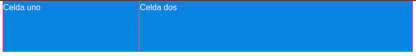

# Foundation

Foundation es un framework Frontend (tambien conocido como Framework CSS) el cual nos ofrece un diseño responsivo a traves de su sistema de grilla (grid) para sitios web (Foundation For Sites) y para emails (Foundation for emails).

> Version de Foundation al momento de este documento: 6.5.3

## Instalación

1. Instalar **nodejs** y **npm**
    En Arch Linux y derivadas (Antergos, Manjaro)

    ```bash
    sudo pacman -Sy nodejs npm
    ```

    En Debian y derivadas (Ubuntu, Linux Mint)

    ```bash
    sudo apt install nodejs npm
    ```

2. Verificar que se instaló correctamente:

    ```bash
    node -v
    ```

3. Instalar **Foundation CLI** con **npm**

    ```bash
    sudo npm install --global foundation-cli
    ```

## Crear nuevo proyecto

1. Crear nueva carpeta

   ```bash
   mkdir new_project_folder
   ```

2. Colocarnos dentro de la nueva carpeta

    ```bash
    cd new_project_folder
    ```

3. Ejecutar el comando new

   ```bash
   foundation new
   ```

4. Seleccionar
   >A website (Foundation for Sites).

5. Esribimos el nombre de nuestro proyecto.

    ```bash
    What's the project called? (no spaces) mi-proyecto
    ```

6. Nos dara elegir entre 2 plantillas
   >* Basic template: Includes a Sass compiler.
   >* ZURB Template: includes Handlebars templates and Sass/JS compilers.

7. Comenzará a descargar las dependencias (esto puede tardar bastante dependiendo de la conexion a internet)

    

8. Ingresamos a la carpeta recién creada

     ```bash
     cd mi-proyecto
     ```

9. Iniciamos npm

    ```bash
    npm start
    ```

## Configuración de Foundation

Dentro de nuestro proyecto tendremos el siguiente arbol de directorios

```markdown
|--dist
|--etc
|--node_modules
|--src
    |--assets
    |--data
    |--layouts
    |--pages
    |--partials
    |--styleguide
```

La carpeta **layouts** contendrá un archivo:
>default.html

 Este archivo dentro de su etiqueta `<body>` tendrá el siguiente codigo `{{> body}}` esto lo va a reemplazar por el contenido que se encuentre en el archivo:
 >index.html

que esta dentro de la carpeta **pages**.

## Incorporando los iconos de Foundation

Agregaremos los iconos llamados **Foundation Icon Fonts 3**

1. Descargamos el archivo zip y lo descomprimimos.
   > <https://zurb.com/playground/foundation-icon-fonts-3>

2. Copiamos la carpeta
   > foundation-icons

3. Nos vamos a la carpeta de nuestro proyecto  y creamos una nueva carpeta llamada **fonts** y pegamos la carpeta de iconos quedamdo nuestro arbol de la siguiente forma:

   ```markdown
    |--src
        |--assets
            |--fonts
                |--foundation-icons
   ```

4. Para poder utilizar estos iconos debemos agregarlos a nuestro archivo
   >default.html

    Los incluimos con la etiqueta

    ```html
    <link rel="stylesheet" href="{{root}}assets/fonts/foundation-icons.css">
    ```

5. Para utilizarlos solo basta con agregarlos mediante ua etiqueta

   ```html
   <i class="fi-heart"></i>
   ```

## Utilizar Foundation con los links de CDN

Además del proceso a través de **npm** podemos también utilizar los enlaces CDN e incluirlos en nuestro archivo **html** para poder utilizar Foundation (sin tener en cuenta un proyecto):

```html
<!-- Compressed CSS -->
<link rel="stylesheet" href="https://cdn.jsdelivr.net/npm/foundation-sites@6.5.3/dist/css foundation.min.css" integrity="sha256-xpOKVlYXzQ3P03j397+jWFZLMBXLES3IiryeClgU5og= sha384-gP4DhqyoT9b1vaikoHi9XQ8If7UNLO73JFOOlQV1RATrA7D0O7TjJZifac6NwPps sha512-AKwIib1 +xDeXe0tCgbc9uSvPwVYl6Awj7xl0FoaPFostZHOuDQ1abnDNCYtxL/HWEnVOMrFyf91TDgLPi9pNg==" crossorigin="anonymous">

<!-- Compressed JavaScript -->
<script src="https://cdn.jsdelivr.net/npm/foundation-sites@6.5.3/dist/js/foundation.min.js" integrity="sha256-/PFxCnsMh+nTuM0k3VJCRch1gwnCfKjaP8rJNq5SoBg= sha384-9ksAFjQjZnpqt6VtpjMjlp2S0qrGbcwF/rvrLUg2vciMhwc1UJJeAAOLuJ96w+Nj sha512-UMSn6RHqqJeJcIfV1eS2tPKCjzaHkU/KqgAnQ7Nzn0mLicFxaVhm9vq7zG5+0LALt15j1ljlg8Fp9PT1VGNmDw==" crossorigin="anonymous"></script>
```

## Paletas de colores

En nuestros diseños en general de Frontend es muy comun usar paletas de colores, podemos hacer uso de un sitio que contiene multiples de estas para obtener diferentes colores

> <https://flatuicolors.com/>

## Grilla XY de Foundation

>Recordemos que por defecto Foundation tiene 12 columnas por fila en su grilla.

Para especificar que queremos una fila lo haremos con `grid-x`

```html
<div class="grid-x">
    <div class="cell">Celda uno</div>
    <div class="cell">Celda dos</div>
</div>
```

Esto nos genera 2 celdas, pero a pesar de que le indicamos que sea horizontal (`grid-x`) las celdas ocupan todo el ancho aparentando tener un alineamiento vertical, esto sucede porque no hemos especificado ningun tamaño.

Para especificar el tamaño de cada celda debemos utilizar los **breakpoints** de Foundation:

>* small (menos de 640px)
>* medium (640px o más)
>* large (1024px o más)

Ahora que conocemos los **breakpoints** vamos a ver como aplicarlos en nuestro codigo:

```html
<div class="grid-x">
    <div class="cell small-6 medium-4">Celda uno</div>
    <div class="cell small-6 medium-8">Celda dos</div>
</div>
```

En resoluciones **small** nos generaria una fila con dos celdas del mismo tamaño, ya que cada celda ocupa seis columnas de las doce columnas disponibles.


En resoluciones **medium** en adelante nos generaria una fila con la primera celda ocupando cuatro columnas y la segunda celda ocupando ocho columnas dando como suma las doce columnas disponibles.



Si quisieramos repartir el tamaño de cada una de las celdas equitativamente debemos agregar la clase `auto`

```html
<div class="grid-x">
    <div class="cell auto">Celda uno</div>
    <div class="cell auto">Celda dos</div>
    <div class="cell auto">Celda tres</div>
    <div class="cell auto">Celda cuatro</div>
    <div class="cell auto">Celda cinco</div>
    <div class="cell auto">Celda seis</div>
    <div class="cell auto">Celda siete</div>
    <div class="cell auto">Celda ocho</div>
    <div class="cell auto">Celda nueve</div>
    <div class="cell auto">Celda diez</div>
</div>
```

Podemos meter la grilla dentro de un `grid-container` para alinear nuestro contenido y conservar un ancho fijo.

```html
<div class="grid-container">
    <div class="grid-x">
        <div class="cell auto">Celda uno</div>
        <div class="cell auto">Celda dos</div>
    </div>
</div>
```

Ahora veamos con funciona la clase `grid-y` esta nos sirve para alinear las celdas de manera **vertical**

```html
<div class="grid-y" style="height:400px;">
    <div class="cell small-6"></div>
    <div class="cell auto"></div>
    <div class="cell auto"></div>
</div>
```

> En este caso le estamos poniendo un alto fijo a nuestra grilla de 400px.

Veamos que al especificar la primera celda con `small-6` le estamos diciendo que tenga un alto de la mitad de nuestra grilla, osea de **200px**, mientras que las demas celdas se repartiran equitativamente el espacio sobrante, en este caso **100px** cada una para sumar los **400px** totales.

## Espaciado dentro de las grillas

Podemos usar `grid-margin` y `grid-padding` para darles un espaciado a las celdas de nuestra grilla

```html
<div class="grid-x grid-margin-x grid-padding-x">
    <div class="cell auto">Celda uno</div>
    <div class="cell auto">Celda dos</div>
</div>
```

Tambien existe una clase para recorrer las celdas **N** posiciones, esto lo logramos con `[small/medium/large]-offset-[posiciones]`

```html
<div class="grid-x">
    <div class="cell small-8 small-offset-2 medium-offset-0 large-offset-2" style="height:100px"></div>
</div>
```

## Incluir parciales

Los archivos parciales nos sirven para tener mejor ordenado nuestro codigo. Estos archivos deberan estar ubicados en la carpeta:

> src/partials/

Una vez creados podemos incluirlos con la sintaxis:

```html
{{> header}}
```

Esto buscara el siguiente archivo:

> src/partials/header.html

## Modificar estilos por defecto de Foundation

Podemos modificar los estilos por defecto editando los archivos de SASS que encontramos en la ruta:

> src/assets/scss/

El parcial de SASS `_settings.scss` es el que contiene todas las variables y estilos por defecto. Al modificar este archivo y guardarlo, automaticamente se aplicaran los cambios al proyecto actual.

## Activar clases de prototipado

Por defecto estan deshabilitadas estas clases, con ellas activas podremos utlizar clases adicionales de texto, margenes, paddings, espaciados.

Para activarlas debemos ir a nuestro archivo SASS `app.scss` y descomentar la linea:

```scss
@include foundation-prototype-classes;
```

Una vez hecho esto ya podremos usar clases como:

>* margin-bottom-0
>* padding-top-0
>* medium-text-uppercase

La lista completa de clases la podemos encontrar en:

> <https://foundation.zurb.com/sites/docs/prototyping-utilities.html">

## Utilizando clases de visibilidad

Podemos usar clases de visibilidad para mostrar/ocultar elementos basados en la resolucion actual.

```html
<p class="show-for-medium">Se muestra a partir de pantallas medianas.</p>
<p class="show-for-large">Se muestra a partir de pantallas grandes.</p>
<p class="show-for-medium-only">Unicamente se muestra en pantallas medianas.</p>
```

## Utilidades de Flexbox

Podemos cambiar el orden de los elementos dependiendo del tamaño de pantalla, esto lo logramos con la clase `order`

```html
<div class="grid-x">
  <div class="cell small-6 small-order-2 medium-order-1">
    Esta columna será segunda en dispositivos pequeños, y primera a partir de medianos.
  </div>
  <div class="cell small-6 small-order-1 medium-order-2">
    Esta columna será primera en dispositivos pequeños, y segunda a partir de medianos.
  </div>
</div>
```

## Agregando un carrusel de imagenes con Orbit

Podemos agregar un carrusel con la clase `orbit`

```html
<div class="orbit" role="region" aria-label="Favorite Space Pictures" data-orbit>
  <div class="orbit-wrapper">
    <div class="orbit-controls">
      <button class="orbit-previous"><span class="show-for-sr">Previous Slide</span>&#9664;&#xFE0E;</button>
      <button class="orbit-next"><span class="show-for-sr">Next Slide</span>&#9654;&#xFE0E;</button>
    </div>
    <ul class="orbit-container">
      <li class="is-active orbit-slide">
        <figure class="orbit-figure">
          
          <figcaption class="orbit-caption">Space, the final frontier.</figcaption>
        </figure>
      </li>
      <li class="orbit-slide">
        <figure class="orbit-figure">
          
          <figcaption class="orbit-caption">Lets Rocket!</figcaption>
        </figure>
      </li>
      <li class="orbit-slide">
        <figure class="orbit-figure">
          
          <figcaption class="orbit-caption">Encapsulating</figcaption>
        </figure>
      </li>
      <li class="orbit-slide">
        <figure class="orbit-figure">
          
          <figcaption class="orbit-caption">Outta This World</figcaption>
        </figure>
      </li>
    </ul>
  </div>
  <nav class="orbit-bullets">
    <button class="is-active" data-slide="0"><span class="show-for-sr">First slide details.</span>
    <span class="show-for-sr">Current Slide</span></button>
    <button data-slide="1"><span class="show-for-sr">Second slide details.</span></button>
    <button data-slide="2"><span class="show-for-sr">Third slide details.</span></button>
    <button data-slide="3"><span class="show-for-sr">Fourth slide details.</span></button>
  </nav>
</div>
```

## Usando Mixins de Foundation

Podemos usar los mixins predefinidos, veremos la lista de ellos en el siguiente enlace:

> <https://foundation.zurb.com/sites/docs/sass-mixins.html>

Por ejemplo podemos usar la clase `font-bold` para utilizar las negritas.

## Usando Helpers de Foundation

Los Helpers son funciones especiales para manipular el contenido de la pagina. Adicionales a los helpers de Handlebars's, Panini incluye unos cuantos y nosotros podemos agregar nuevos.

> <https://foundation.zurb.com/sites/docs/panini.html>

Por ejemplo `repeat`:

```html
{{#repeat 25}}
  <div class="cell">Contenido de celda</div>
{{/repeat}}
```

> Esto nos generara 25 lineas identicas a lo que esta dentro de las llaves de repeat.

## Agregando un menu lateral Off-canvas

Para configurar un menu **Off-canvas**, el cual es un menu que se desliza desde fuera de la pantalla hacia dentro de nuestro contenido, solo necesitamos tres elementos:

* Un container con la clase `.off-canvas` y el atributo `data-of-canvas`

```html
  <div class="off-canvas position-left" id="offCanvas" data-off-canvas>
    <!-- El menu del Off-canvas va aquí dentro -->
  </div>
  ```

* Un container con la clase `.off-canvas-content` y el atributo `data-off-canvas-content`, dentro del container colocaremos el contenido de nuestro sitio.

```html
<div class="off-canvas-content" data-off-canvas-content>
  <!-- El contenido de nuestro sitio va aquí dentro -->
    {{> body}}
  </div>
```

* Un boton que al presionarlo abra el menu, esto lo logramos asigando el atributo `data-toogle="ID_DEL_CONTAINER-DEL-MENU-OFF-CANVAS"`

```html
<button type="button"  class="button" data-toggle="offCanvas">
    <i class="fi-list"></i>
</button>
```

## Usando Smooth Scroll para suavizar el desplazamiento

Este plugin nos permite obtener un efecto de desplazamiento suave al desplazar en nuestros menus, lo unico que debemos agregar es el atributo `data-smooth-scroll` a nuestro menu.

```html
<ul class="menu" data-smooth-scroll>
    <li><a href="#primera-seccion">Primera</a></li>
    <li><a href="#segunda-seccion">Segunda</a></li>
    <li><a href="#tercera-seccion">Tercera</a></li>
</ul>
```